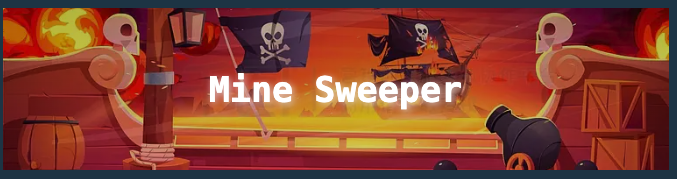
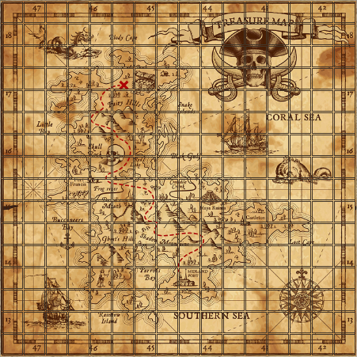
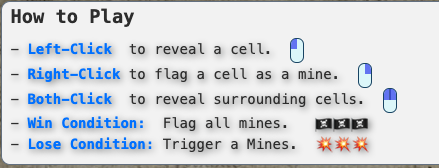

# Mine Sweeper 🏴‍☠️




**An adventurous pirate-themed twist on the classic Mine Sweeper!**

[**🎮 Play Now**](https://seanfuxiao.github.io/MineSweeper-ChallengeGame/) · [**💻 GitHub Repo**](https://github.com/SeanFuXiao/MineSweeper-ChallengeGame.git) · [**🐞 Report Bug**](https://github.com/SeanFuXiao/MineSweeper-ChallengeGame/issues) · [**✨ Request Feature**](https://github.com/SeanFuXiao/MineSweeper-ChallengeGame/issues)

---

## Table of Contents

- [About The Project](#about-the-project)
- [Built With](#built-with)
- [Getting Started](#getting-started)
- [Roadmap](#roadmap)
- [Contributing](#contributing)
- [Contact](#contact)
- [Acknowledgments](#acknowledgments)

---

## About The Project



**Mine Sweeper** takes the traditional puzzle game to the high seas! Navigate a treacherous grid filled with hidden mines. Flag all the mines to win, but beware—trigger one, and it's game over!

### Why This Project?

- **Unique Theme**: A pirate ship battle aesthetic brings a fresh, adventurous twist.
- **Engaging Gameplay**: The familiar Mine Sweeper mechanics with added excitement.

[back to top](#table-of-contents)

---

## Built With

- **JavaScript**: Core game logic and interactivity.
- **HTML5**: Structure and layout of the game.
- **CSS3**: Responsive design and styling.
- **Canvas Confetti**: Animated celebration effects.

[back to top](#table-of-contents)

---

## Getting Started

You can start playing the game immediately or set it up locally by following the instructions below:

### Option 1: Play Online

- **[Play Now](https://seanfuxiao.github.io/MineSweeper-ChallengeGame/)**: Click the link to start playing the game directly in your browser.

### Option 2: Run Locally

To set up the game on your local machine:

1. ***Clone the Repository***:
   ```bash
   git clone https://github.com/SeanFuXiao/MineSweeper-ChallengeGame.git
   ```


2. ***Navigate to the Project Directory***:
   ```bash
   cd MineSweeper-ChallengeGame
   ```

3. ***Open the Game in Your Browser***

   You can now open the index.html file in your preferred web browser to   start the game locally.


[back to top](#table-of-contents)

---

### How to Play




**Pro Tip**: Explore Dark Mode for a different visual experience!

[back to top](#table-of-contents)

---

## Roadmap

Future enhancements include:

- **Leaderboard**: Track and showcase top scores globally.
- **Multiplayer Mode**: Compete against other players in real-time.
- **Additional Themes**: Space, jungle, and more!
- **Accessibility Improvements**: Enhanced screen reader compatibility and keyboard navigation.

Check out the [open issues](https://github.com/SeanFuXiao/MineSweeper-ChallengeGame/issues) for a full list of proposed features and known issues.

[back to top](#table-of-contents)

---

## Contributing

Contributions are what make the open-source community such a fantastic place to learn, inspire, and create. Any contributions you make are **greatly appreciated**.

To contribute:

1. Fork the Project
2. Create your Feature Branch (`git checkout -b feature/AmazingFeature`)
3. Commit your Changes (`git commit -m 'Add some AmazingFeature'`)
4. Push to the Branch (`git push origin feature/AmazingFeature`)
5. Open a Pull Request

Don't forget to give the project a star if you liked it! ⭐

[back to top](#table-of-contents)

---

## Contact

If you have any questions or suggestions, feel free to contact me:

- **Email**: [seanfuxiao@gmail.com](mailto:seanfuxiao@gmail.com)

Project Link: [https://github.com/SeanFuXiao/MineSweeper-ChallengeGame](https://github.com/SeanFuXiao/MineSweeper-ChallengeGame)


[back to top](#table-of-contents)

---

## Acknowledgments


- **[JavaScript](https://developer.mozilla.org/en-US/docs/Web/JavaScript)**: The core programming language used to implement the game's logic and interactivity.
- **[HTML5](https://developer.mozilla.org/en-US/docs/Web/Guide/HTML/HTML5)**: Used to structure and layout the game.
- **[CSS3](https://developer.mozilla.org/en-US/docs/Web/CSS)**: Provided styling and responsive design for the game, especially the custom UI elements and dark mode.
- **[Canvas-Confetti](https://www.npmjs.com/package/canvas-confetti)**: Used to trigger cool confetti animations when the player wins, enhancing the user experience.
- **[Google Fonts (Monospace)](https://fonts.google.com/)**: Used to provide a modern and readable font style for the game.
- **[MDN Web Docs](https://developer.mozilla.org/en-US/docs/Web)**: Offered comprehensive documentation and resources that helped resolve various technical challenges during development.


[back to top](#table-of-contents)
